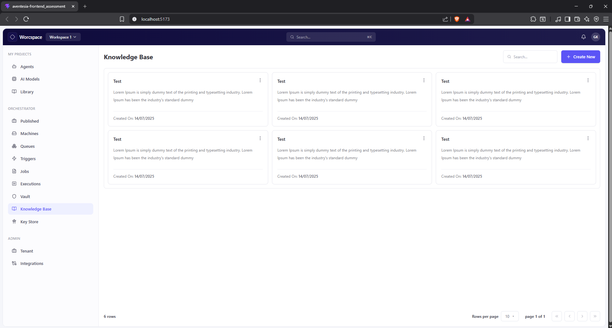
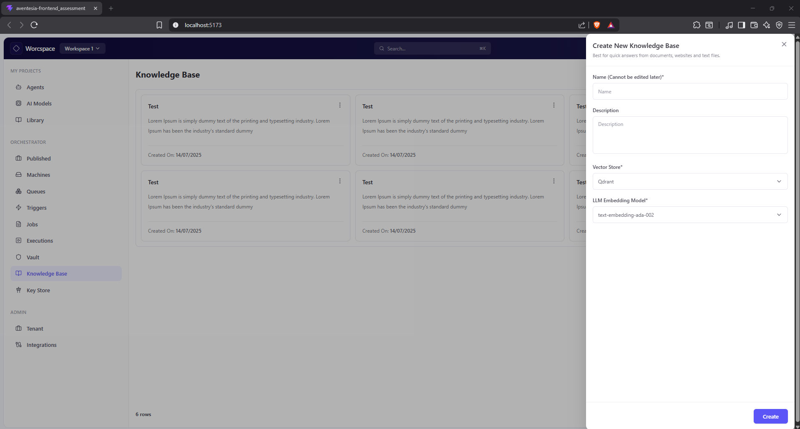

# Aventisia Knowledge Base UI - Frontend Assignment

A React + Tailwind CSS implementation of the **Knowledge Base UI** based on the provided design screens for the Aventisia Junior Developer practical assignment.

---

## Overview

This project recreates the two required UI states:

- **Knowledge Base Home Screen**
- **Create New Knowledge Base Drawer** opened from the `Create New` button

The goal of this assignment was to replicate the provided design as closely as possible while keeping the code modular, reusable, and easy to maintain.

---

## Demo Link

[Click here for checking out the DEMO](https://aventisia-assessment-43kyeszt0-musclesgloves-projects.vercel.app/)

---

## Screenshots






---

## Tech Stack

- **React**
- **Vite**
- **Tailwind CSS**
- **lucide-react** for icons

---

## Features

- Responsive Knowledge Base dashboard layout
- Reusable component-based structure
- Static left sidebar navigation
- Top navigation bar with search and profile area
- Knowledge base cards displayed in a grid layout
- Bottom pagination/info section
- Functional **Create New** button
- Right-side drawer modal for creating a new knowledge base

---

## Project Structure

```bash
src/
├── components/
│   ├── common/
│   │   ├── Button.jsx
│   │   └── Modal.jsx
│   └── kb/
│       ├── CategoryCard.jsx
│       ├── SearchBar.jsx
│       └── Sidebar.jsx
├── data/
│   └── categories.js
├── layout/
│   └── TopNavbar.jsx
├── pages/
│   └── HomePage.jsx
├── App.jsx
├── index.css
└── main.jsx
```

---

## Getting Started

### 1. Clone the repository

```bash
git clone <your-repository-url>
cd aventesia-frontend_assessment
```

### 2. Install dependencies

```bash
npm install
```

### 3. Start the development server

```bash
npm run dev
```

### 4. Build for production

```bash
npm run build
```

### 5. Preview the production build

```bash
npm run preview
```

---

## Design Notes

- Primary color used: `#4F46E5`
- Secondary color used: `#1E1B4B`
- Layout and interactions were implemented to closely match the provided assignment screens
- Only the **Create New** action is interactive, as required

---

## Deliverables Included

- Source code
- UI implementation of both required screens
- Create drawer interaction
- Ready-to-run Vite project structure

---

## Possible Future Improvements

- Add full responsiveness for smaller mobile breakpoints
- Add keyboard accessibility improvements
- Add form validation for drawer inputs
- Add real pagination and API-backed data

---

## Author

**Keshav Rao Sathvick**